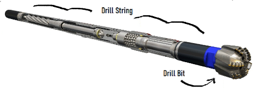

# The Interstellar Asteroid Rush


Greetings Travelers! Welcome to Extraplanetary Orbital Geologists, as a fledgling space drilling engineer you have been tasked with optimizing resource recovery from our new exploratory asteroid field. Work together with your team to build an out of this world solution for analyzing and visualizing your approach to maximize recovery in your asteroid play all while minimizing expenditure for maximal profits!

We have prepared some historic real-time measurements from a handful of previous asteroid drilling operations including some of the ways to calculate the costs associated with them and it’ll be up to your team to explore the data and evaluate the capital efficiency of the drill bits used in those operations.

> Can your team determine which asteroid was the most economically drilled? Which drill bit is the most efficient? Can you find any correlations between the columns to better understand how each bit performs? Better yet can you use your findings to make decisions in real-time on when a bit should be abandoned and replaced for future drilling operations?

Work together to try and tackle these among many other potential ways to analyze the data to build an application, be it a web app, mobile app, or pure analysis tool to help better understand our drilling data so we can improve our asteroid mining speed, cost and efficiency to infinity and beyond.

You will be tasked with communicating your findings to the space board of Exploratory Orbital Geologists.

[Mark Metzger](https://www.linkedin.com/in/mark-metzger-731b36a3/), Chief Space Manager of Software Optimizations

[Mike Shin](https://www.linkedin.com/in/shindohyun/), Chairman of Lightspeed Data Engineering

[Aaron Shaffer](https://www.linkedin.com/in/aaron-shaffer/), Principal Developer of SpaceTime Tooling

[Hunter Brown](https://www.linkedin.com/in/hunter-brown-43767476/), Engineering Director of Directional Asteroid Drilling

Who will judge your tools and reward the winners with epic prizes:

```
1st Place: 4x DJI Mini SE
2nd Place 4x Skullcandy Crusher Evo Bluetooth Headphones
```

# Judging

There are many ways to tackle how to approach understanding and anlyzing drilling data such as what has been provided.

> During realtime asteroid drilling operations massive amounts of data are collected at a both various time and depth intervals. There are lots of knobs that can be tuned to minimize costs during the operations however at the core of the decision making process behind which knob should be tuned is a base level understanding of the data and how it should be interpreted or approached

**You are an asteroid drilling software engineering devloper tasked with developing an application to help plan drilling new asteroids, say up to 19,000 ft deep**

- Visualize and Compare Asteroid Drill Runs

  - Provide charts/graphs over the data to show drilling performance

  - UI Elements to change what you are comparing across multiple asteroids

  - Depth vs Cost Curves

  - Bin compare and rank drilling performance

- Analyze Optimize and output a drilling plan

  - Fastest

  - Cheapest

Work together to try and tackle these among many other possible ways to analyze the data to build an application, be it a web app, mobile app, or pure analysis tool that could be used to better understand our drilling data so we can improve our asteroid mining speed, cost and efficiency to infinity and beyond.

# Vocab

> ## Rate of Penetration

> #### `RATE_OF_PENETRATION`
>
> The rate that the drill bit is penetrating and removing rock downhole. More rate of penetration is better for drilling efficiency, as the drill bit wearing down with use will degrade this rate over time. Other factors may or may not be direcly correlated with this variable.

> ## Hook Load
>
> #### `HOOK_LOAD`
>
> The weight of the drill string pulling downwards, into the rock, on the asteroid mining rig. It’s the weight felt by the drilling setup plus or minus any things downhole that might be affecting the drill string.
>
> 

> ## Differential Pressure
>
> #### `DIFFERENTIAL_PRESSURE`
>
> In order to keep the drill bit cool and lubricated a drilling fluid is pumped along the length of the drill string to keep the bit cool and operational. Differential Pressure is the difference in pressure exerted by the fluid being pumped down the drill string and the weight of the drilling fluid in the asteroid bore above it.

> ## Weight on Bit
>
> #### `WEIGHT_ON_BIT`
>
> The force being exerted on the drill bit, how hard its pushing into the rock that is currently being drilled.

# Costs

Several different drill bit setups were used in the drilling runs previously and below are the financials on what it costs to run those bits.

| DRILL_BIT_NAME  | Cost Per Run | Cost Per Foot | Cost Per Hour |
| --------------- | -----------: | ------------: | ------------: |
| Buzz Drilldrin  |         5000 |           1.5 |             0 |
| Astro Bit       |         3000 |             1 |          1500 |
| Apollo          |         1000 |             4 |          2500 |
| ChallengDriller |        10000 |             0 |             0 |

Total Cost for a drill run is

`CostPerRun + ( FT * CostPerFoot ) + ( Hours * CostPerHour )`

The time needed to replace a bit is `30s per 100ft` of depth, each way

# Data

Attached is a folder containing real-time measurements from 20 previous asteroid drilling efforts. The columns are as follows. For any questions about the dataset please swing by our booth!

## Columns

| Column                |        Type | Units |
| --------------------- | ----------: | ----: |
| BIT_DEPTH             |   numerical |    ft |
| RATE_OF_PENETRATION   |   numerical | ft/hr |
| HOOK_LOAD             |   numerical |  klbs |
| DIFFERENTIAL_PRESSURE |   numerical |   psi |
| WEIGHT_ON_BIT         |   numerical |  klbs |
| DRILL_BIT_ID          | categorical |   N/A |
| DRILL_BIT_NAME        | categorical |   N/A |

Good Luck Hackers!
